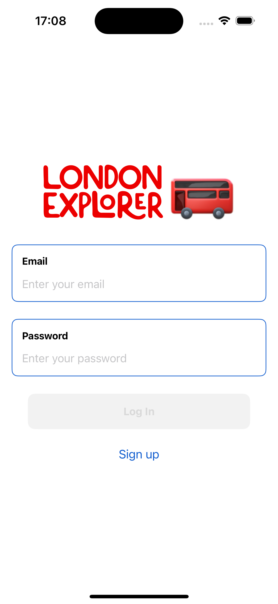
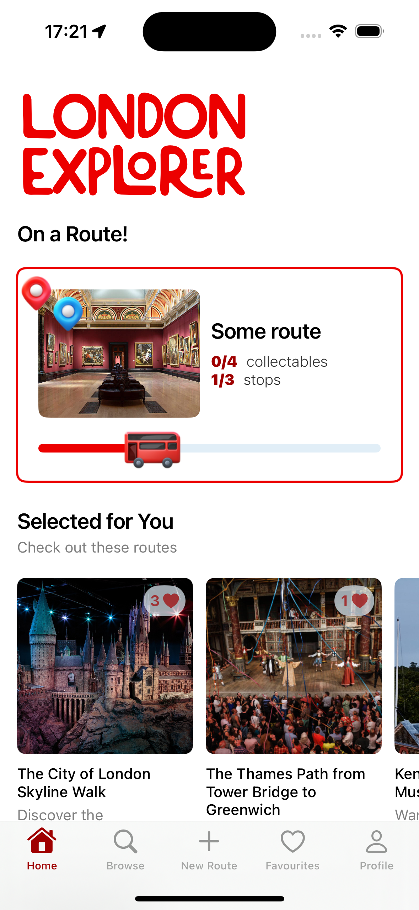
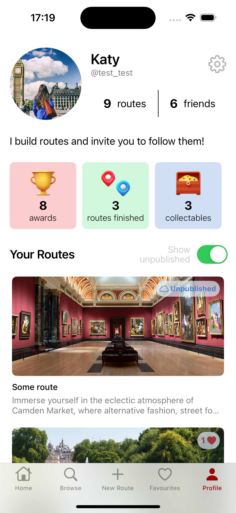
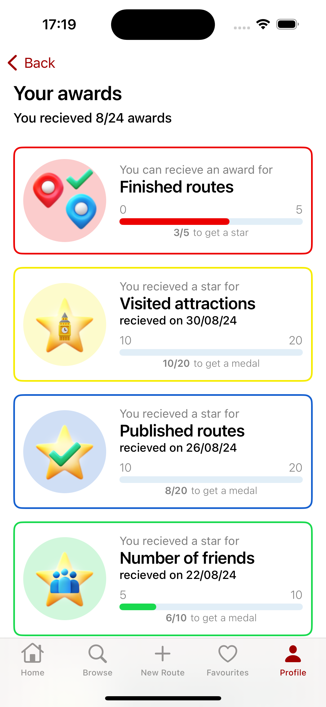
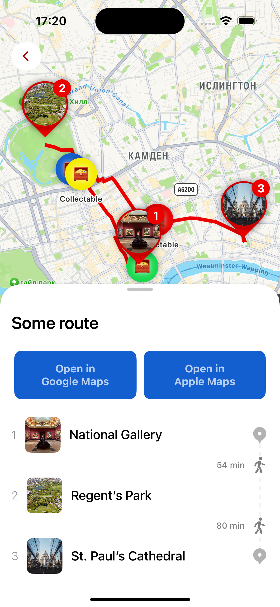
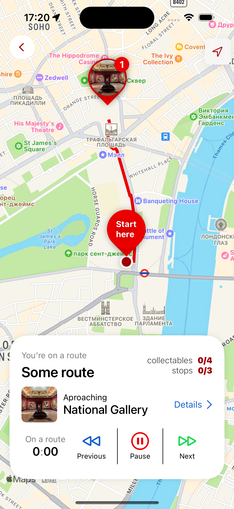
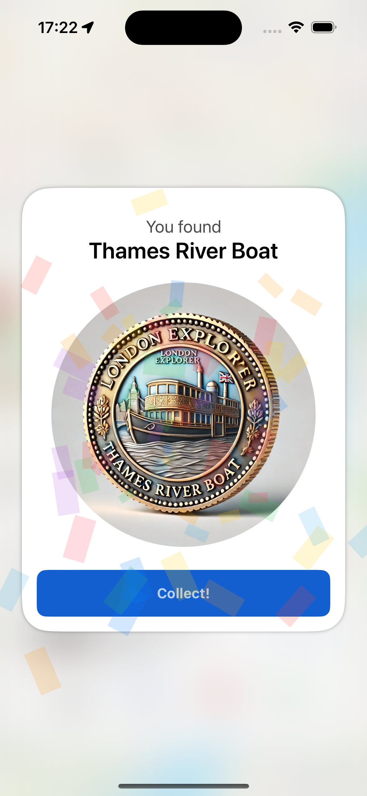
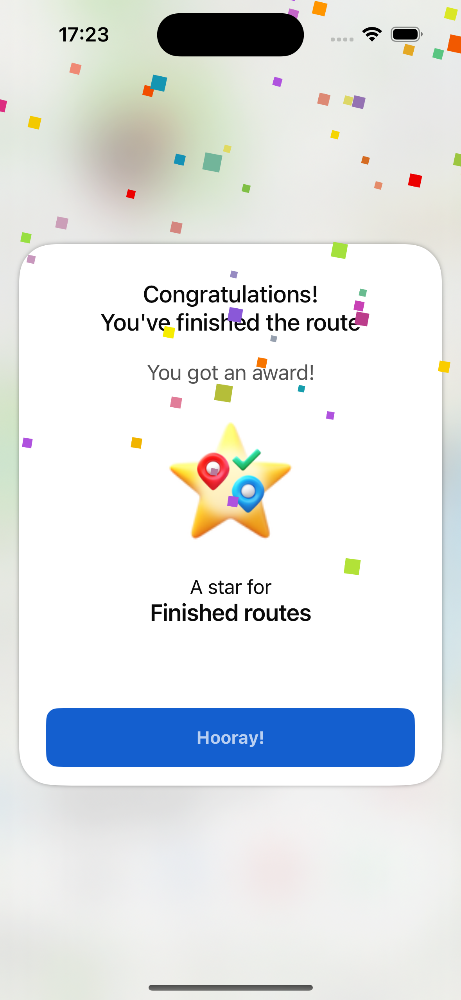
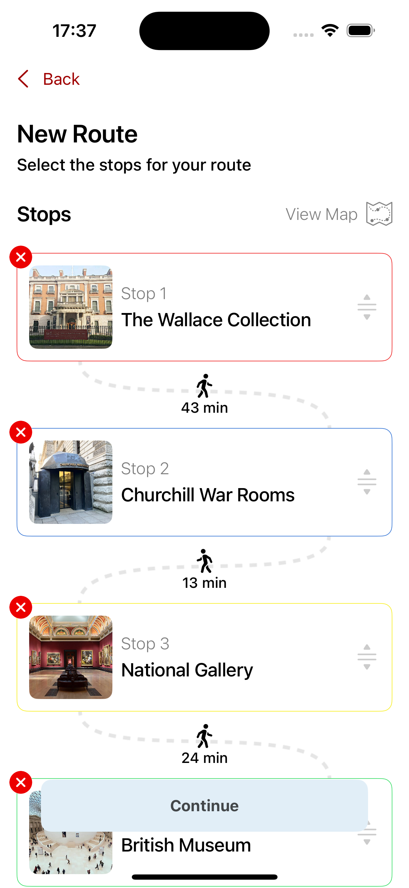
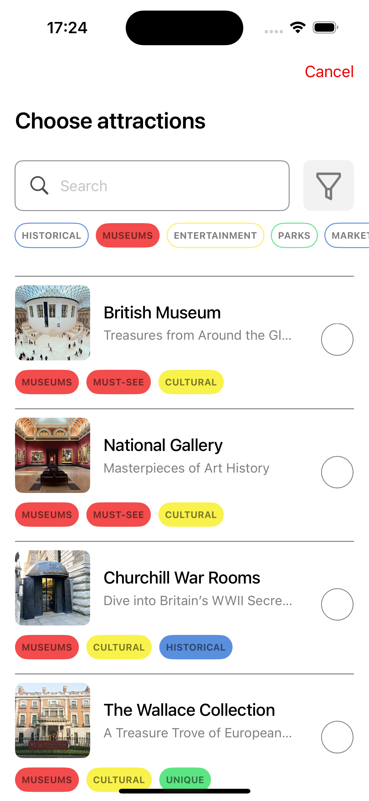

# London Explorer — iOS + Spring Boot Modular Architecture

📹 [Demo video](https://drive.google.com/file/d/1tl4DR5qIYxWN_CztKQcC1NM70mVMm0hJ/view?usp=sharing)

London Explorer is a SwiftUI-based iOS application with a modular Spring Boot backend, designed for gamified city exploration. The app allows users to build, save, and complete custom walking routes in London, unlock collectables, earn awards, and interact with friends through a dynamic activity feed.

This project was developed as a final thesis for an MSc in Software Engineering and demonstrates advanced iOS architecture patterns, RESTful integration, and microservice-based backend design.

---

## 🧩 Project Architecture

### High-level Context Diagram
<p align="center">
  
</p>

### iOS App
- **Framework**: SwiftUI (no UIKit)
- **Architecture**: MVVM + Environment Injection + Clean Module Separation
- **Persistence**: `UserDefaults` / local state caching
- **Navigation**: Fully declarative, state-driven routing via `AppCoordinator`
- **Async logic**: Swift Concurrency (async/await), `@MainActor`, background data fetching
- **Reusable UI**: Custom `ViewModifiers`, `ButtonStyles`, composable layout abstractions
- **Firebase Integration**: Firebase Auth
- **Testing**: Unit tests for view models and controllers

### Backend (Spring Boot Microservices)
- **Services**:
  - `api_users` — user profile, friends, awards, finished routes
  - `api_routes` — user-generated routes, stops, saves, collectables, leaderboards
  - `api_attractions` — searchable attraction metadata
- **Tech stack**: Java 21, Spring Boot 3, PostgreSQL, JPA/Hibernate
- **Design**:
  - Each service is independently deployable
  - Clear data boundaries between user, route, and attraction domains
  - Custom SQL and JPQL queries for performance-critical endpoints
- **Testing**: JUnit 5, Mockito

---

## 🚀 Core Features

<p align="center">
  
  
  
  
  
  
  
  
  
  
</p>

### iOS
- Create a custom walking route by selecting real attractions
- Save and complete routes; progress is synced with backend
- Collect virtual items (collectables) by finishing routes
- Unlock visual awards with level tracking
- Dynamic home feed with recent activities of mutual friends (routes, awards, new friendships)
- Offline-friendly UI with graceful fallback states

### Backend
- User registration via Firebase UID
- Collectable tracking tied to `FinishedRoute`
- Award logic supports multiple levels and prevents duplicates
- Friend system via symmetric `Friend` entity, with validation and decline
- Top saved routes leaderboard (`LIMIT + COUNT GROUP BY`)
- Feed aggregation via efficient `UNION` native SQL query across route/award/friend events

---

## 📦 Deployment and Usage

Each backend module (`api_users`, `api_routes`, `api_attractions`) is a separate Spring Boot app. They share a PostgreSQL instance and expose REST APIs consumed by the SwiftUI client.

To run:
1. Start PostgreSQL with predefined schemas
2. Launch each service individually:
   ```bash
   ./mvnw spring-boot:run
3. Update the base URL in the iOS app for local or remote testing
4. Build and run the SwiftUI app via Xcode

---

## 🔭 Potential Extensions
Although the current version is complete, the project was built with future scalability in mind:
- **Modularization of iOS codebase:** Swift Package separation for core, UI, networking, domain
- **Push notifications:** Firebase Cloud Messaging support for friend updates and awards
- **CoreData sync layer:** for offline-first UX and historical data access
- **Admin dashboard:** React or SwiftUI web frontend for attraction moderation and route insights
- **Analytics backend:** Track route popularity, engagement time, drop-off points
- **OAuth integration:** Google/Twitter login alongside Firebase Auth

---

## 🎓 Academic Context
This application was built as the capstone project for a Master’s in Software Engineering, aiming to demonstrate:
- Mastery of declarative UI frameworks (SwiftUI)
- Expertise in full-stack REST architecture
- Scalable modular code design
- End-to-end system thinking across mobile and backend layers

---

## 📲 Screen Flows
The following diagrams illustrate the main user journeys:

<p align="center">
  <br/>
  <b>Main Flow</b>
</p>
<p align="center">
  <br/>
  <b>Create Route Flow</b>
</p>
<p align="center">
  <br/>
  <b>My Profile Flow</b>
</p>
<p align="center">
  <br/>
  <b>User Profile Flow</b>
</p>
